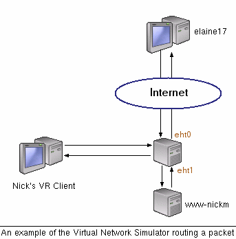
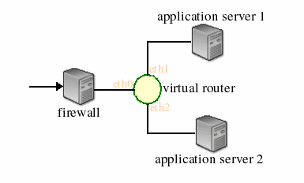

# simple-router
Cloned from https://www.cs.princeton.edu/courses/archive/spr12/cos461/assignments/assignments-router.html

Mininet version: https://github.com/mininet/mininet/wiki/Simple-Router

## 1.1 Introduction

In this assignment you will implement a fully functional Internet router that routes real network traffic. The goal is to give you hands-on experience as to how a router really works. Your router will run as a user process locally, and when finished will route real packets that are flowing across the Internet to application servers located at Stanford. We'll be giving you a skeleton, incomplete router (the "sr" or simple router) that you have to complete, and then demonstrate that it works by performing traceroutes, pings and downloading some files from a web server via your router.

## 1.2 Overview of the Virtual Network System (VNS)

The VNS was designed at Stanford, for their introductory networking course and they're nice enough to let us use it too. It gives you hands-on experience working on projects requiring low level network access, such as routers. The VNS is comprised of two components: (1) The VNS Server which runs in a lab at Stanford, and (2) A number of VNS Clients which connect to the server. Your router is an example of a VNS Client. The server intercepts packets on the network, forwards the packets to the clients, receives packets from the client and injects them back into the network.

### 1.2.1 The VNS Server

The server is a user level process running at Stanford. The machine hosting the server is connected to a hub which is connected to two Linux servers running a few internet services (http, ftp, and a streaming music server on port 8888), referred to as application servers. The VNS Server simulates a network topology which consists of multiple links and VNS Clients, and allows access to application servers from the Internet. For example, the simplest topology (say, topology 0) is one with a single VNS Client and one application server, as shown below in the figure. In the figure, elaine17 runs a web client and accesses an application server on www-nickm. A VNS server one hop before www-nickm intercepts the packets and sends them to the VNS client named "Nick's VR Client", which implements the routing logic.



A VNS client wanting access to traffic in the network connects to the VNS server via a normal TCP socket and requests the traffic seen on links in the topology. Assuming the traffic is not already being sent to some other user, the server accepts the request and sends the traffic on the link to the client over the TCP socket. The client would then inspect the packet, determine where the next hop in the network and send the packet back to the server to be injected back into the network.

The VNS Server can handle multiple (2^16) topologies simultaneously. This means that each student can have his or her own topology to connect to and route over. The VNS Server ensures that clients are only sent traffic belonging to their topology.

### 1.2.2 The VNS Client

A VNS client is any program that speaks the VNS protocol and connects to the VNS server. In the case of this assignment we provide you with the code for a basic VNS client (called sr or Simple Router) that can connect to the VNS server. The VNS clients are run locally by the students as regular user processes and connect to the VNS server via normal TCP sockets. VNS clients, once connected to the VNS server, are forwarded all packets that they are supposed to see in the topology. The VNS clients can manipulate the packets in any way they wish, generate responses based on the packets, or make routing decisions for those packets and send the replies back to the VNS server to place back onto the network. For example, in topology 0, the VNS server might receive a TCP SYN packet destined for an application server. The VNS server sends the packet to the VNS client which would receive the packet on interface zero, decrement the TTL, recalculate the header checksum, consult the routing table and send the packet back to the VNS server with directions to inject it back onto the network out of interface one.

In this assignment you will implement a fully functional router by extending the sr code given to you.

### 1.2.3 Packet Flow Through the System

VNS allows you to build virtual network topologies consisting of nodes that operate on actual Ethernet frames. This is why your router node can process and send real Ethernet frames and send them over the network like a real router. You don't have to know how VNS works to complete this assignment, but the following packet flow example may be useful, for example, while debugging.

The following scenario is a step by step explanation of how a client routes traffic on a simple topology.

Nick has just finished developing his router for programming assignment #2. He was assigned topology 42 for testing which is shown in the figure below. The firewall shown is simply the hop before Nick's assigned topology.



Nick runs his router from mycomputer.home.edu and connects to the VNS server at vns-1.stanford.edu, topology 42. The VNS server sends Nick's router the list of interfaces and their IP addresses.

To generate traffic for routing, Nick fires up a standard web browser from his local computer pointed at the IP of the application/web server on topology 42. Nick's router will now get the opportunity to route all packets between his web browser and the web server. Note that Nick can run his web browser on any machine and not necessarily on the one running the VNS client.

We'll now walk through the first few significant steps that take place when packets flow between Nick's web browser and the web server.

* A SYN packet leaves Nick's machine destined to the web server's IP and is routed to the VNS server.
* The diligent stanford VNS staff have arranged for Nick's packet to be delivered to topology 42. The hop before Nick's router, i.e., the firewall, determines that the packet should be forwarded to the virtual router and sends an ARP request to determine the Ethernet address corresponding to the router's IP address.
* The VNS server captures this ARP request, and sends the raw Ethernet frame over a TCP socket to Nick's VNS client. His client processes the ARP request and responds with an ARP reply. This response is again sent over the TCP socket to the VNS server which transmits it to the firewall.
* On receipt of the ARP reply, the firewall then forwards the SYN packet to Nick's router.
* The VNS server intercepts the SYN packet and sends the raw Ethernet frame over the socket to Nick's VNS client for him to route.
* Nick's router decrements the TTL field in the IP header and recalculates checksums as appropriate.
* Nick's router looks up its routing table and determines that the next hop for the SYN packet is the web server.
* When Nick's router has made its routing decision, it must send back to the VNS server a complete Ethernet packet. This means that the router must first find the Ethernet address of the next hop by generating an ARP request on the appropriate interface. This is achieved through the VNS server.
* The web server responds to the ARP request, which is captured by the VNS server. Nick's client completes the Ethernet packet and sends it back to the VNS server. (The client also caches the ARP reply for future use.)
* The VNS server sends the packet out of the correct interface (eth1 or eth2), to the next hop in the topology (application server 1 or 2).
* .... etc. 

## 1.3 Get Started

Before beginning development you should download the stub code (from the top of this page) and save it locally. As described before, it handles all of the dirty-work required for connecting and communicating with the server. To run the code, untar the package (tar -zxvf sr_stub.tar.gz) and compile it via make.

You should receive an email from us which tells you the username, initial password, and the topology ID for you in VNS. You can log in the VNS Web Interface. Then in Your profile, change the default password we gave you. Copy the Simulation Auth Key, and save it in a file named auth_key in the stub_sr directory.

Next, go to Topologies and find the topology ID we gave you. In its details, download the Topology Routing Table, and save it in a file named rtable in the ``stub_sr`` directory.

Once these things are done, you can connect to the VNS server as follows:

`````
./sr -s vns-1.stanford.edu -t <topo-id> -a auth_key -r rtable
`````

for example, connecting to the server on topology 42 would look like:

`````
./sr -s vns-1.stanford.edu -t 42 -a auth_key -r rtable
`````

(you can use ./sr -h to print a list of the accepted command line options)

If the auth_key way doesn't work for you, you can also use:

`````
./sr -s vns-1.stanford.edu -t <topo-id> -u <your_username>
`````

Note that the auth_key and rtable are only required for the first time. Later you can just use ./sr -s vns-1.stanford.edu -t <topo-id> to connect to the VNS.

After you connect successfully, the server will send you a description of the host including all the interfaces and their IP addresses.

The routing table is constructed from the file rtable and by default consists of only the default route which is the firewall. The routing table format is as follows:

ip gateway mask interface
`````
172.24.74.213 172.24.74.213 255.255.255.255 eth1
172.24.74.228 172.24.74.228 255.255.255.255 eth2
0.0.0.0 172.24.74.17 0.0.0.0 eth0
`````
  
The VNS Server also returns the IP addresses associated with each one of the interfaces. The stub code uses this information to build the interface list in the router (the head of the list is member if_list for struct sr_instance). The output for each interface should look something like:

`````
        INTERFACE: eth0
        Hardware Address: 70:00:00:00:00:01
        Ethernet IP: 172.24.74.41
        ...
`````
  
To test if the router is actually receiving packets try pinging or running traceroute to the IP address of eth0. The sr should print out that it received a packet. What type of packet do you think this is?

What should your router do on receipt of an ARP request packet?
1.4 Inspecting Packets with tcpdump

As you work with the sr router, you will want to take a look at the packets that the router is actually sending and receiving. The easiest way to do this is by logging packets to a file and then displaying them using a program called tcpdump.

First, tell your router to log packets to a file in a format that tcpdump can read by passing it the -l option and a filename:
`````
./sr -t <topo-id> -s vns-1.stanford.edu -l <logfile>
`````
  
As the router runs, it will log the packets that it receives and sends (including headers) to the indicated file. After the router has run for a bit, use tcpdump to display the packets in a readable form:

`````
tcpdump -r <logfile> -e -vvv -x
OR /usr/sbin/tcpdump -r <logfile> -e -vvv -x on Friend center machines
`````
  
The -r option tells tcpdump where to look for the logfile. -e tells tcpdump to print the headers of the packets, not just their payload. -vvv makes the output very verbose, and -x puts the packets in a hex format that is usually easier to read than ASCII. You may want to specify the -xx option instead of -x to print the link-level (Ethernet) header in hex as well.


1.5 Developing Your Very Own Router Using the SR Stub Code
1.5.1 Data Structures You Should Know About

* The Router (sr_router.h):
    The full context of the router is housed in the struct sr_instance (sr_router.h). sr_instance contains information about topology the router is routing for as well as the routing table and the list of interfaces. 

* Interfaces (sr_if.c/h):
    After connecting, the server will send the client the hardware information for that host. The stub code uses this to create a linked list of interfaces in the router instance at member if_list. Utility methods for handling the interface list can be found at sr_if.h/c. 

* The Routing Table (sr_rt.c/h):
    The routing table in the stub code is read on from a file (default filename "rtable", can be set with command line option -r ) and stored in a linked list of routing entries in the current routing instance (member routing_table). 

1.5.2 The First Methods to Get Acquainted With

The two most important methods for you to get familiar with are:

`````
    void sr_handlepacket(struct sr_instance* sr, uint8_t * packet/* lent */, unsigned int len, char* interface/* lent */) 
`````
  
This method, located in sr_router.c, is called by the router each time a packet is received. The "packet" argument points to the packet buffer which contains the full packet including the ethernet header. The name of the receiving interface is passed into the method as well.

`````
    int sr_send_packet(struct sr_instance* sr /* borrowed */, uint8_t* buf /* borrowed */, unsigned int len, const char* iface /* borrowed */) 
`````
  
This method, located in sr_vns_comm.c, will send an arbitrary packet of length, len, to the network out of the interface specified by iface.

### 1.5.3 Dealing with Protocol Headers

Within the sr framework you will be dealing directly with raw Ethernet packets. There are a number of resources which describe the protocol headers in detail, including Stevens UNP www.networksorcery.com and the Internet RFC's for ARP (RFC826), IP (RFC791), and ICMP (RFC792). The stub code itself provides some data structures in sr_protocol.h which you may use to manipulate headers. There is no requirement that you use the provided data structures, you may prefer to write your own or use standard system includes.

**Ethernet**

You are given a raw Ethernet frame and have to send raw Ethernet frames. You should understand source and destination MAC addresses and the idea that we forward a packet one hop by changing the destination MAC address of the forwarded packet to the MAC address of the next hop's incoming interface.

**Internet Protocol**

Before operating on an IP packet, you should verify its checksum and make sure it meets the minimum length of an IP packet. You should understand how to find the longest prefix match of a destination IP address in the routing table. If you determine that a datagram should be forwarded, you should correctly decrement the TTL field of the header and recompute the checksum over the changed header before forwarding it to the next hop.

**Internet Control Message Protocol**

ICMP is a simple protocol that can send control information to a host. In this assignment, your router will use ICMP to send messages back to a sending host. You will need to properly generate the following ICMP messages (including the ICMP header checksum) in response to the sending host under the following conditions:

  *  Echo reply (type 0)
    Sent in response to an echo request (ping) to one of the router's interfaces. (This is only for echo requests to any of the router's IPs. An echo request sent elsewhere should be forwarded to the next hop address as usual.)
   * Destination unreachable (type 3, code 0)
    Sent if there is a non-existent route to the destination IP (no matching entry in routing table when forwarding an IP packet).
  *  Destination host unreachable (type 3, code 1)
    Sent if five ARP requests were sent to the next-hop IP without a response.
  *  Port unreachable (type 3, code 3)
    Sent if an IP packet containing a UDP or TCP payload is sent to one of the router's interfaces. This is needed for traceroute to work.
  *  Time exceeded (type 11, code 0)
    Sent if an IP packet is discarded during processing because the TTL field is 0. This is also needed for traceroute to work.

The source address of an ICMP message can be the source address of any of the incoming interfaces, as specified in RFC 792.

As mentioned above, the only incoming ICMP message destined towards the router's IPs that you have to explicitly process are ICMP echo requests.

**Address Resolution Protocol**

ARP is needed to determine the next-hop MAC address that corresponds to the next-hop IP address stored in the routing table. Without the ability to generate an ARP request and process ARP replies, your router would not be able to fill out the destination MAC address field of the raw Ethernet frame you are sending over the outgoing interface. Analogously, without the ability to process ARP requests and generate ARP replies, no other router could send your router Ethernet frames. Therefore, your router must generate and process ARP requests and replies.

To lessen the number of ARP requests sent out, you are required to cache ARP replies. Cache entries should time out after 15 seconds to minimize staleness.

When forwarding a packet to a next-hop IP address, the router should first check the ARP cache for the corresponding MAC address before sending an ARP request. In the case of a cache miss, an ARP request should be sent to a target IP address about once every second until a reply comes in. If the ARP request is sent five times with no reply, an ICMP destination host unreachable is sent back to the source IP as stated above.

In the case of an ARP request, you should only send an ARP reply if the target IP address is one of your router's IP addresses. In the case of an ARP reply, you should only cache the entry if the target IP address is one of your router's IP addresses.

Note that ARP requests are sent to the broadcast MAC address (ff-ff-ff-ff-ff-ff). ARP replies are sent directly to the requester's MAC address.

 ## 1.6 Required Functionality

We will declare that your router is functioning correctly if and only if:

    The router can successfully route packets to and from the application servers.
    The router correctly handles ARP requests and replies.
    The router correctly handles traceroutes through it (where it is not the end host) and to it (where it is the end host).
    The router responds correctly to ICMP echo requests.
    The router handles TCP/UDP packets sent to one of its interfaces. In this case the router should respond with an ICMP port unreachable.
    The router maintains an ARP cache whose entries are invalidated after a timeout period (timeouts should be on the order of 15 seconds).
    The router does not needlessly drop packets (for example when waiting for an ARP reply). The router queues all packets waiting for outstanding ARP replies (even though RFC 826 seems to suggest that you can throw the packet away if a mapping doesn't exist). If a host does not respond to 5 ARP requests, the queued packet is dropped and an ICMP host unreachable message is sent back to the source of the queued packet. 

Also, don't forget to fill out your README! (It is worth 1 point)
